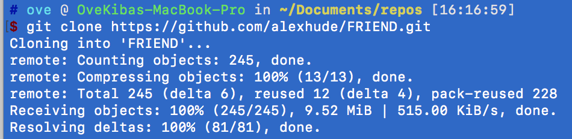
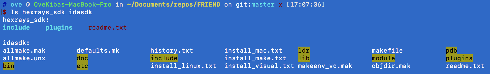
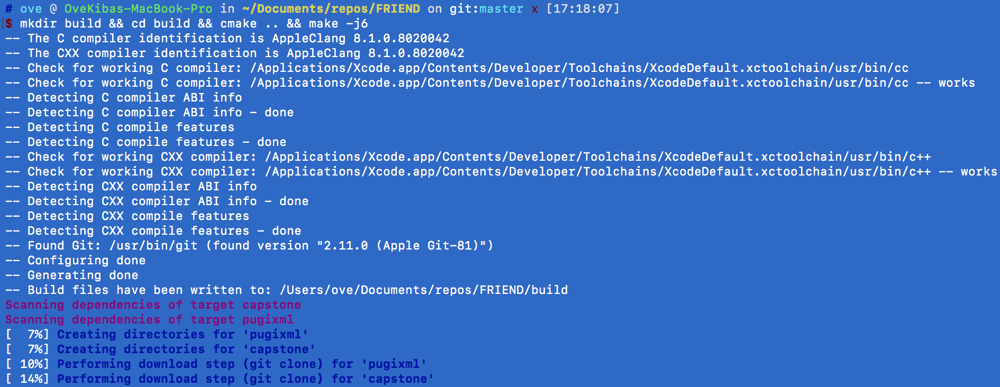
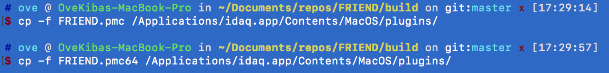
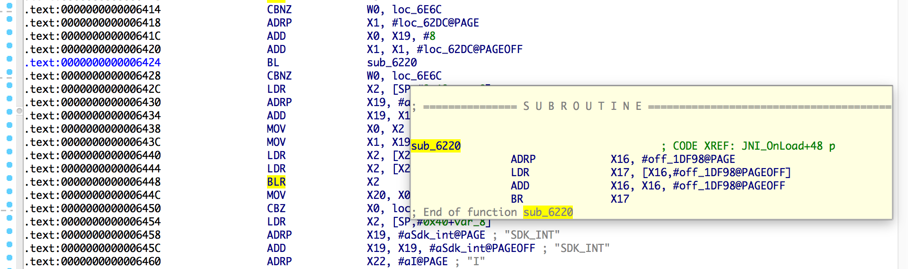
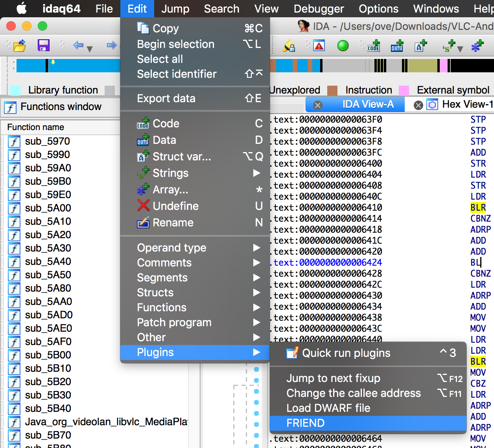
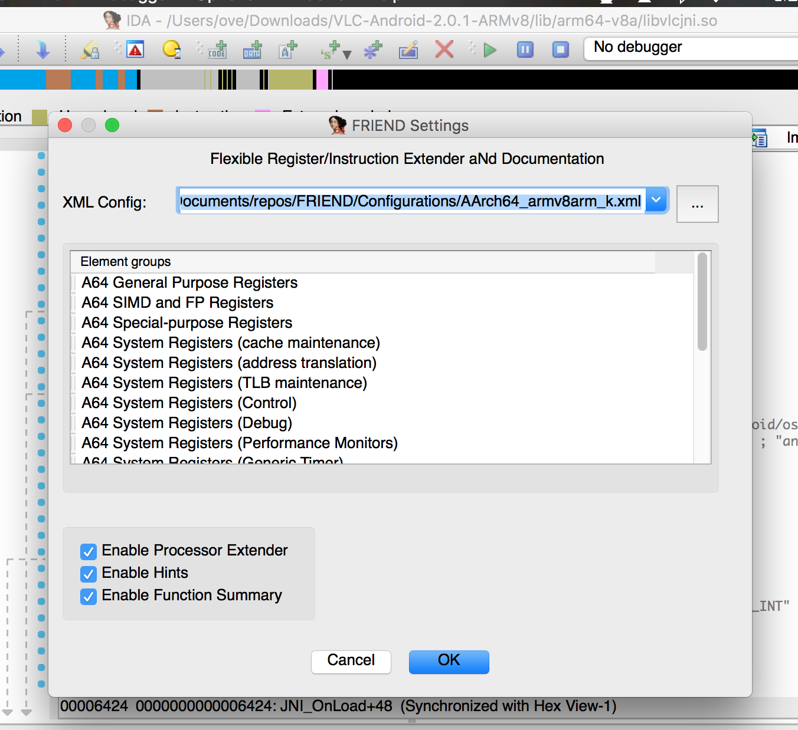
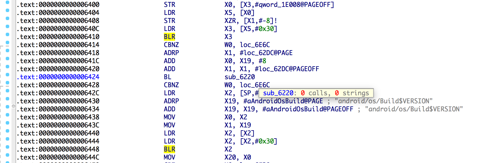
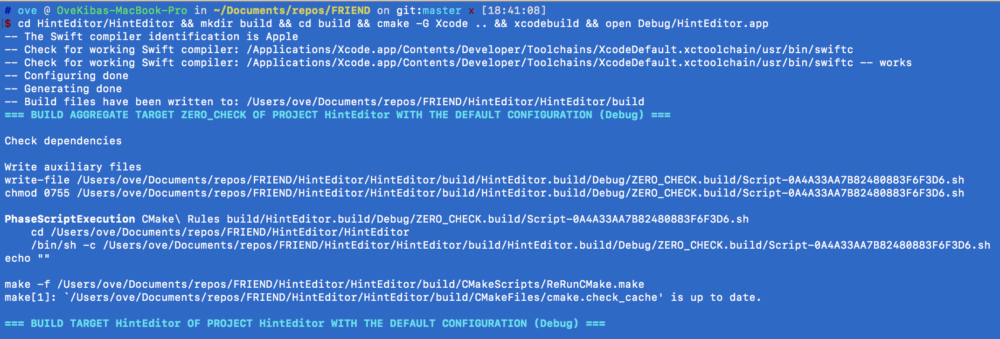
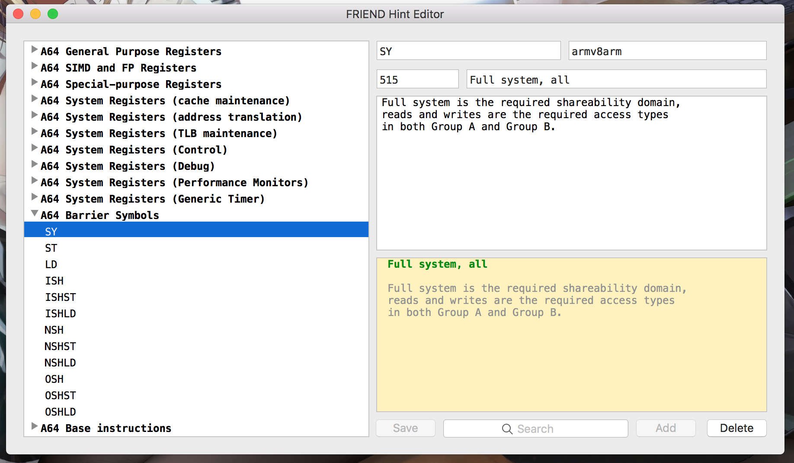

# IDA插件FRIEND(Flexible Register/Instruction Extender aNd Documentation)的编译及使用

插件地址：[FRIEND](https://github.com/alexhude/FRIEND)

插件git提交的版本：d9b0833e05401e963fed55c4fba05b3b2aa49848

作者：[kiba](https://github.com/ovekiba/)


--------


## 一、FRIEND介绍

FRIEND(Flexible Register/Instruction Extender aNd Documentation)是反汇编软件[IDA](https://www.hex-rays.com/products/ida/index.shtml)的一个功能增强插件。它能提高IDA反编译结果的可读性，为指令和寄存器提供参考文档。其主要功能如下：

> 1. 利用第三方的库(如：[Capstone](http://www.capstone-engine.org))提高反汇编结果的可读性。
> 2. 为指令和寄存器显示对应的信息。
> 3. 在外部的浏览器中打开选中的指令或寄存器的参考文档。
> 4. 显示函数的调用总结。
> 5. 可以根据需要，开启和关闭不同的指令及寄存器的提示信息。


## 二、环境要求

FRIEND支持Windows、Linux和macOS。不同的平台，需要的软件稍有不同，如下：

> 1. [CMake](https://cmake.org) 3.3或者更高的版本。
> 2. 编译器：GCC或着Clang(Linux、macOS)、Visual Studio 2015或更高版本(Windows)。
> 3. [Git](https://git-scm.com)
> 4. IDA SDK
> 5. Hex-Rays SDK(macOS下的Hex-Rays SDK在IDA的安装目录下的Contents/MacOS/plugins/hexrays_sdk目录中，此SDK可选)


注意：

> 1. 插件的开发者使用的IDA版本是6.95，不是此版本的IDA时，编译出来的插件部分功能将失效。本文使用的环境是macOS、IDA6.8，部分功能失效。
> 2. macOS下的CMake在安装后无法直接在终端命令中使用，需要手动添加到PATH路径中
```shell
export PATH=$PATH:/Applications/CMake.app/Contents/bin
```


## 三、编译安装FRIEND

1、首先，将FRIEND下载到本地。


2、然后将IDA SDK、Hex-Rays SDK分别解压拷贝到FRIEND目录下的idasdk、hexrays_sdk目录下。


3、使用下面的命令即可编译插件。


如果没有Hex-Rays SDK，就使用下面的命令编译。
```shell
mkdir build && cd build && cmake -DUSE_HEXRAYS=OFF .. && make -j6
```

4、将编译生成的插件(build目录下的FRIEND.pmc和FRIEND.pmc64文件)拷贝到IDA的安装目录下的Contents/MacOS/plugins下即完成插件的安装。



## 四、使用FRIEND

因为此次使用的是IDA6.8，而不是与作者相同的IDA6.95，所以只有一个功能能够正常使用，就是函数调用总结的提示。

打开IDA，并分析一个armv8架构的程序。


依次点击 Edit -> Plugins -> FRIEND，来配置FRIEND。


配置文件选择之前下载的FRIEND目录下Configurations目录下的AArch64_armv8arm_k.xml即可。


配置完后，就能在IDA中看到函数调用的总结了。



## 五、配置编辑工具HintEditor

FRIEND作者还提供了一个用于编辑配置的软件HintEditor，软件需要自己编译。

使用下面的命令即可编译，并在编译成功时会自动打开HintEditor。


HintEditor可以新建配置，也编辑以后的配置。

